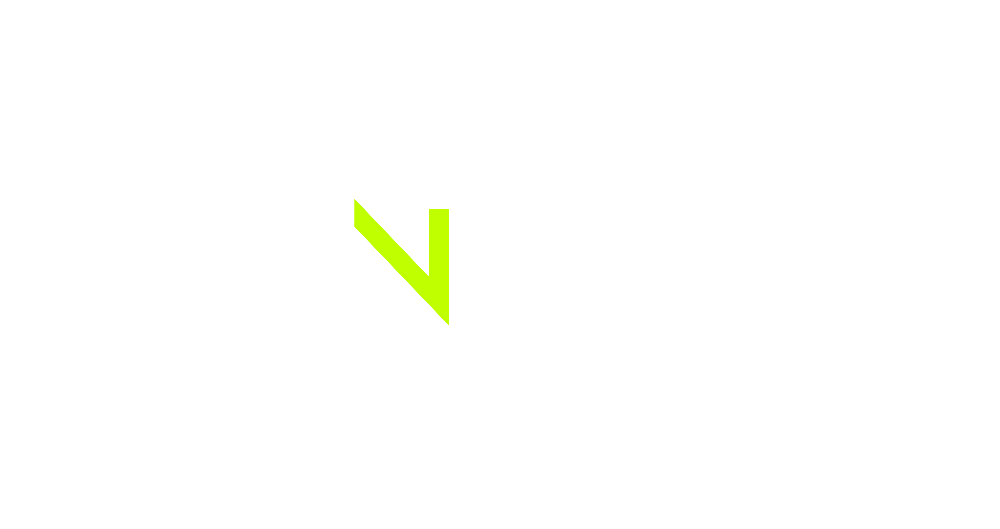

# Konnected Reverse Raffle



Konnected Reverse Raffle is a versatile web application created using `Python`, `Django`, `HTML`, and `CSS`. Additionally, it can be installed as a desktop application rendered with `PyQt5`. This project was completed, involving both backend and frontend development. The primary purpose of this application is to simplify the process of hosting and managing events, particularly for users who want to display event details on a projector.

## Features

#### 1. Admin-Friendly Interface

Konnected Reverse Raffle provides an intuitive and user-friendly interface for event organizers. Whether you're new to event management or an experienced host, the application's interface simplifies the setup and execution of your event.

#### 2. Event Configuration

Customize your event to meet your specific needs with ease. Administrators can configure a wide range of event settings, including:

- **Logos**: Upload your event's logo to give it a personalized touch.
- **Prize Information**: Add details about the prizes participants can win.
- **Themes**: Choose from a variety of themes to create a unique event atmosphere.
- **Date and Location**: Specify the event date and location for clear communication.
- **Messages**: Include messages to display to viewers/participants during the event.
- **Background Images**: Optionally, set a background image to enhance the visual appeal.

#### 3. Participant Management

Effortlessly manage participant information using the application's participant management features. Administrators can upload participant details, such as unique numbers and names, streamlining the event setup process.

#### 4. Real-Time Event Execution

Konnected Reverse Raffle excels in real-time event execution, making your event seamless and engaging:

- **Barcode Scanning**: Admins can scan participant barcodes using a scanner for quick entry.
- **Manual Entry**: Manually enter participant numbers if needed.
- **Participant Elimination**: Eliminate participants as the event progresses, with the application keeping track of eliminations.
- **Last Eliminated Participant**: Keep viewers informed about the latest eliminations with real-time updates in the title bar.
- **Participant Retrieval**: If an incorrect elimination occurs, easily retrieve participants by pressing SHIFT+Enter.
- **Elimination Visualization**: Eliminated participants' tiles are blacked out, providing visual clarity.

#### 5. Event Progress Updates

Stay informed about the event's progress with real-time updates:

- **Participant Count**: The sidebar displays the current situation of the event, including the number of participants eliminated and remaining.
- **Last Eliminated Participant**: The title bar shows the name and number of the last eliminated participant.
- **Top Participants**: A pop-up displays the last 10 participants left when only 10 remain.
- **Winner Announcement**: Celebrate the winner with a popup displaying their name and number, along with the prize details.

#### 6. License Key System

For added security and control, Konnected Reverse Raffle implements a license key system. Users can access the software using a valid license key, allowing for time-limited usage. This feature ensures that event organizers can manage their events securely and effectively.

These features collectively make Konnected Reverse Raffle a powerful tool for event organizers, simplifying event management and enhancing the experience for both administrators and participants.

## Getting Started

### For Users

1. Download the application installer.
2. Purchase a license key from [gearcs](https://gearcs.com/test).
3. Go through the Installation process of the software and enter the license key to validate.
4. Configure event settings, upload participant information, and start the event.

### For Developers/Contributors

1. Clone the repository or download the source code.
2. Create and activate a virtual environment.
3. Install project dependencies.
4. Create an `.env` file with the necessary environment variables (see below).
5. Ensure that the required files and configurations exist in the project folder.
6. Start the server using `python manage.py runserver <port>`.

#### Environment Variables (`.env`)

- `KONNECTED_REVERSE_RAFFLE_ACCESS_KEY`: Your access key.
- `KONNECTED_REVERSE_RAFFLE_SECRET_KEY`: Your secret key.
- `REGION_NAME`: AWS region name.
- `GMAIL_USER`: Gmail username for sending emails.
- `GMAIL_APP_PASSWORD`: App password for Gmail.

### Desktop App (Additional Steps)

- Create another virtual environment.
- Install requirements from `interface_requirements.txt`.

### MacOS (Specific Setup)

For MacOS, the server (the web app) is implemented in Flask instead of Django. The setup process for the desktop app remains the same. However, the server will be different. It is recommended to create and activate a separate virtual environment for MacOS and install the requirements from `mac_server/requirements.txt`.

#### Creating Installers

For MacOS:
Use `python3 mac_server/setup.py py2app`.

For Windows:
Use the following commands:
```bash
pyinstaller -Fw --onefile --name=konnected-reverse-raffle --icon=images/logo/konnected-logo-icon.ico main.py

pyinstaller --name=konnected-server --onefile --additional-hooks-dir=hooks --add-data="frontend/static;frontend/static" --add-data="frontend/templates;frontend/templates" --add-data="frontend/media;frontend/media" manage.py
```

## Ratio
    1000x650

## Themes

Konnected Reverse Raffle offers the following themes for personalization:
- Pink
- Purple
- Black
- Yellow
- Aqua
- Sunset
- Flower
- Industrial
- Midnight


## License

This project is licensed under the [MIT License](LICENSE).

For any questions, issues, or feedback, please reach out to the project maintainers.


## [Screenshots](./images/screenshots/)
